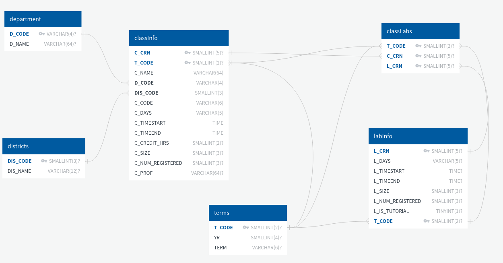

# API documentation

This contains all the code related to the API (and scrapping of class off of the academic timetable)

Running `scrapping.py` will store the class information into a generated file, `database.sql`.
The database SQL definition is contained in `template.sql`, and is inserted into the start of `database.sql` by the scrapping script.

## To start the API

First you must store your database credentials in `cred_mysql.py` as a dictionary named `credentials` with keys `username` and `password`.
It is very important to note that this file is included in the .gitignore so no one accidentally uploads database credentials to git.

Once you have initiated your database using the generated `database.sql` file you may start the API by running `app.py`.
Make sure that you run the generated `database.sql` file in your
database of choice (it is designed for MySQL/MariaDB).
The API is not finalized, however it should be safe to run. It should not be vulnerable to SQL injection due to using SQL Alchemy 
preparred statements.

## Extra notes

### Database schema
Here is a diagram of the MySQL database: 

A quick summary of the tables is: 
- department
    - All available departments and their 4 character code
- districts
    - All available districts (eg. Halifax, Truro) and their character code
- terms 
    - All availabe terms and their year
- classInfo
    - All information about a specific class lecture
- labInfo 
    - All information about a specific class lab/tutorial (they are the same pretty much)
- classLabs
    - Relationship between classes and labs in a specific term